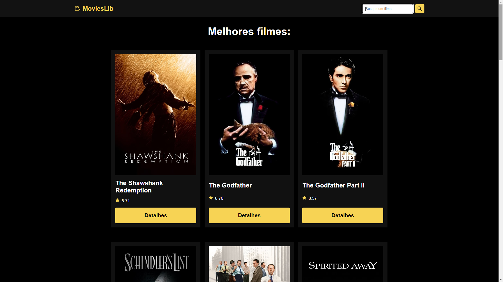
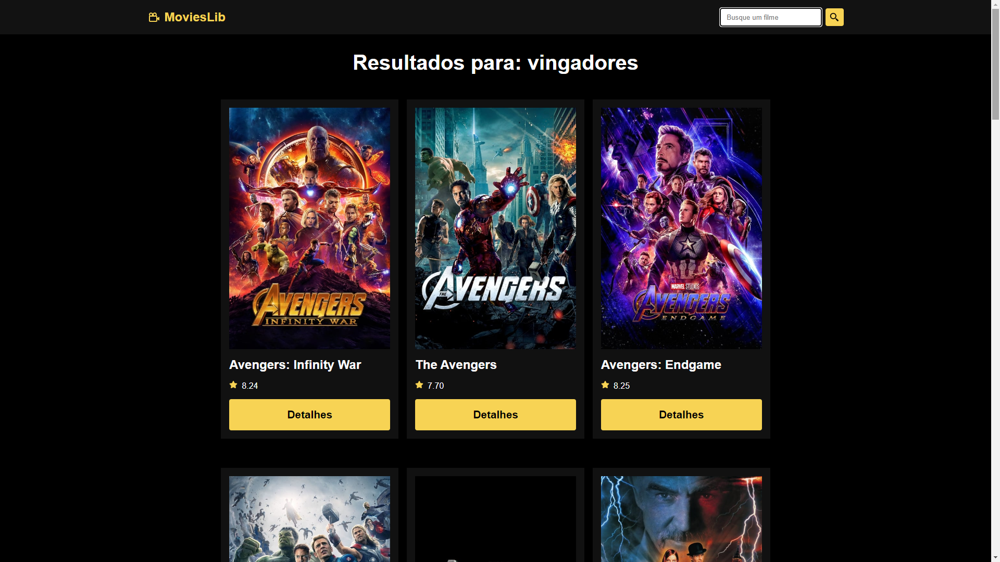
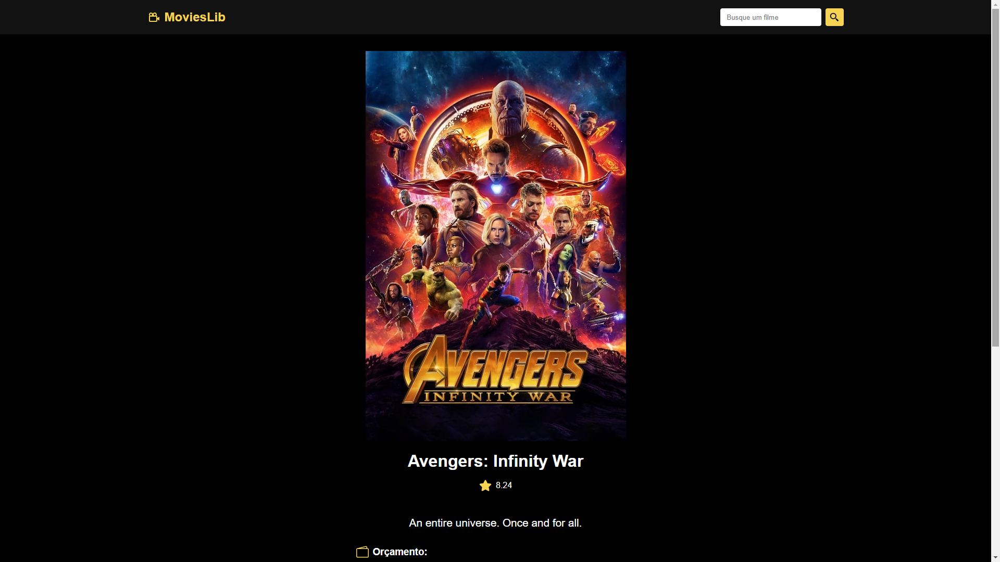

<div align="center"> <h1>MoviesLib</h1> </div>

<p align="center">Explore uma vasta coleção de filmes e acesse informações detalhadas sobre suas obras favoritas!</p>

## 📝 Sobre o projeto

O MoviesLib foi desenvolvido com React.js e utiliza a API do TheMovieDB para exibir uma lista dos filmes mais bem avaliados da história do cinema. Além de poder buscar filmes atuais, a aplicação permite visualizar detalhes como sinopse, orçamento e duração.

## 🛠 Tecnologias utilizadas

-   **React.js** - Biblioteca JavaScript para construção de interfaces
-   **JavaScript** - Linguagem de programação
-   **HTML** - Estrutura do conteúdo
-   **CSS** - Estilização da interface

## 📸 Screenshots

<p align="center">
  
</p>

<p align="center">
  
</p>

<p align="center">
  
</p>

## 🌐 Acesse o projeto online
Você pode acessar a versão online do projeto [aqui](https://movies-lib-react.netlify.app/).

## 🖥️ Como configurar o projeto

Siga os passos abaixo para instalar e executar o projeto em seu ambiente local:

### 1. Clone o repositório:

```bash
$ git clone https://github.com/mauricio071/MoviesLib
```

### 2. Acesse o diretório do projeto:

```bash
$ cd MoviesLib
```

### 3. Instale as dependências necessárias:

```bash
$ npm install
```

### 4. Configure o ambiente:
Para que o projeto consiga consumir a API, siga estes passos:

#### 1. Crie uma conta no [TheMovieDB](https://www.themoviedb.org).
#### 2. Acesse a seção de configurações da API em seu perfil e copie sua chave API.
#### 3. Cole a chave no arquivo .env do projeto, da seguinte forma:

```bash
VITE_API_KEY=api_key=SUA-CHAVE
```
Além disso, adicione os seguintes valores ao arquivo .env:

```bash
VITE_API=https://api.themoviedb.org/3/movie/
VITE_SEARCH=https://api.themoviedb.org/3/search/movie
VITE_IMG=https://image.tmdb.org/t/p/w500/
```

### 5. Inicialize o projeto:

```bash 
$ npm run dev
```
Agora você pode acessar o projeto no navegador em http://127.0.0.1:5173/ (ou na porta indicada pelo terminal).
